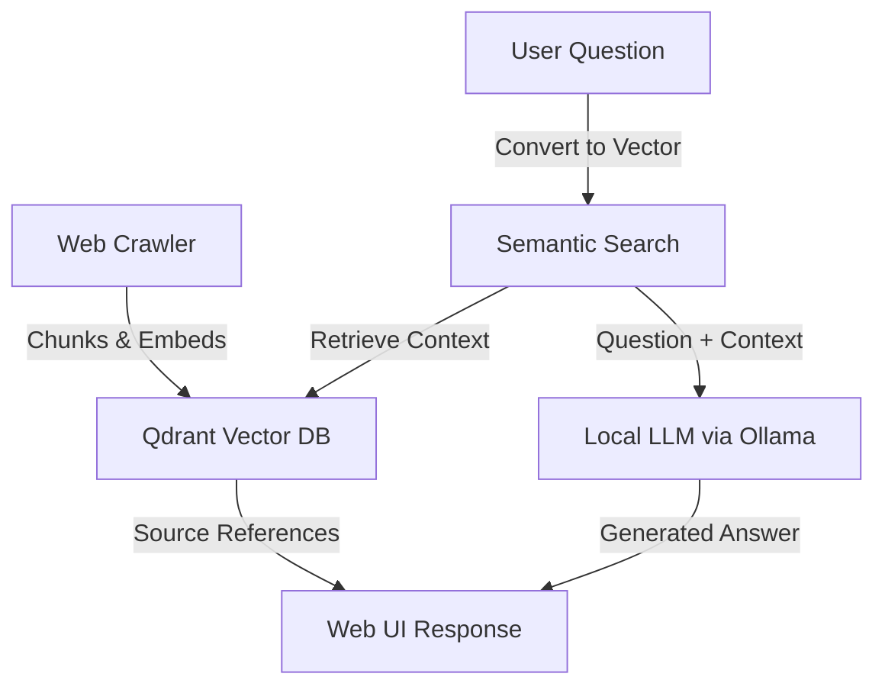

# 🤖 KnowledgeBot

### RAG-Powered AI Assistant for Custom Knowledge Domains

*Ready Tensor Agentic AI Developer Certification - Module 1 Project*


---

## 🎯 Project Overview

**KnowledgeBot** is a Retrieval-Augmented Generation (RAG) AI assistant that enables intelligent question-answering over custom document collections. This project represents the culmination of Module 1 in the Ready Tensor Agentic AI Developer Certification Program (AAIDC), demonstrating foundational concepts of agentic AI through practical implementation.

### What Makes This Special

Unlike traditional chatbots that rely solely on pre-trained knowledge, KnowledgeBot creates specialized knowledge domains by:

- **Crawling and indexing** web content or Wikipedia articles into a vector database
- **Performing semantic search** to find relevant context for user questions  
- **Generating informed responses** using local LLMs with retrieved context
- **Maintaining source transparency** by showing which documents informed each answer

### 🎓 Educational Context

This project serves as the first practical deliverable in the AAIDC program, where participants learn to build production-ready agentic AI systems. The implementation showcases:

- **RAG Pipeline Architecture**: Prompt formulation → Vector retrieval → LLM response generation
- **Local AI Infrastructure**: Self-hosted LLMs and vector databases for privacy and control
- **Semantic Search**: Vector embeddings for intelligent content retrieval
- **Full-Stack Integration**: From data ingestion to user-facing interfaces

---

## 🏗️ System Architecture

KnowledgeBot implements a modern RAG architecture with the following components:



### Core Components

- **🕷️ Web Crawler**: Go-based crawler that processes web content, converts HTML to markdown, and chunks text for optimal vector storage
- **🗄️ Vector Database**: Qdrant for fast semantic search with cosine similarity
- **🧠 Local LLM**: Ollama running models like `qwen2.5:3b` for response generation
- **🌐 Web Interface**: Clean, responsive UI for natural question-answering
- **📡 API Layer**: RESTful endpoints with Server-Sent Events for real-time streaming

---

## 🚀 Quick Start

### Prerequisites

- [Docker](https://docs.docker.com/engine/install/) with [Compose plugin](https://docs.docker.com/compose/install/)
- Minimum 8GB RAM (more recommended for larger models)
- 5GB+ free disk space
- Internet connection for initial model downloads

### Installation & Setup

1. **Clone and Start Services**

```bash
git clone https://github.com/yourusername/knowledgebot.git
cd knowledgebot
make compose-up
```

2. **Download Required Models**

```bash
make pull-models
```

*Note: Model download may take 5+ minutes depending on connection speed*

3. **Index Your First Knowledge Domain**

```bash
# Example: Crawl Futurama Wikipedia content
make crawl-wikipedia-futurama

# Or crawl any website
make crawl URL=https://example.com MAX_DEPTH=2
```

4. **Start Asking Questions!**

Open [http://localhost:8080](http://localhost:8080) and try asking:

- "What are the main Futurama characters?"
- "Tell me about Professor Farnsworth"
- "How does the Planet Express ship work?"

---

## 🎮 Usage Examples

### Web Interface

The primary interface provides an intuitive chat experience:

- **Real-time Streaming**: Responses stream as they're generated
- **Source Attribution**: Each answer shows which documents were used
- **Context Snippets**: Preview the exact text passages that informed the response

### API Integration

For programmatic access:

```bash
curl "http://localhost:8080/api/qna?q=What%20are%20the%20main%20Futurama%20characters?"
```

The API returns Server-Sent Events with structured JSON:

```json
{"sources": [{"url": "...", "title": "...", "snippets": [...]}]}
{"chunk": "The main characters in Futurama include..."}
```

### Custom Domain Creation

Create specialized knowledge bases for any topic:

```bash
# Academic research domain
make crawl URL=https://arxiv.org/list/cs.AI/recent MAX_DEPTH=2

# Product documentation
make crawl URL=https://docs.python.org/3/ MAX_DEPTH=3

# Company knowledge base
make crawl URL=https://your-company.com/docs MAX_DEPTH=2
```

---

## 🔧 Configuration & Customization

### Environment Variables

Key configuration options (see `.env_example`):

```bash
KLB_OPENAI_URL=http://ollama:11434    # LLM service endpoint
KLB_OPENAI_KEY=ollama                 # API key for LLM service
```

### Model Selection

Easily swap LLM models by modifying `cmd/knowledgebot/serve.go`:

- **qwen2.5:3b** (default) - Balanced performance and resource usage
- **llama2:7b** - Higher quality responses, more resource intensive
- **codellama:7b** - Specialized for technical/programming questions

### Crawling Parameters

Fine-tune content ingestion:

- `--max-depth`: How deep to follow links (default: 1)
- `--url-regex`: Filter URLs with regex patterns
- `--score-threshold`: Minimum similarity score for search results

---

## 📊 Technical Implementation Details

### RAG Pipeline Deep Dive

**1. Document Ingestion**

- HTML content converted to clean markdown using `html-to-markdown`
- Text chunked into 768-character segments with 175-character overlap
- Each chunk embedded using `all-minilm` model (384 dimensions)
- Metadata preserved (URL, title, content) for source attribution

**2. Semantic Retrieval**

- User questions converted to vectors using same embedding model
- Cosine similarity search in Qdrant with configurable thresholds
- Up to 15 most relevant chunks retrieved per query
- Results ranked by relevance score

**3. Response Generation**

- Retrieved context combined with system prompt template
- Local LLM generates responses without sending data to external services
- Streaming output provides real-time user feedback
- Source references maintained throughout the pipeline

### Performance Characteristics

- **Search Latency**: <100ms for similarity queries
- **Response Time**: 2-30 seconds depending on question complexity and hardware
- **Scalability**: Supports thousands of documents per collection
- **Privacy**: All processing happens locally - no data leaves your infrastructure

---

## 🎯 AAIDC Learning Objectives Demonstrated

This project successfully demonstrates key Module 1 concepts:

### ✅ RAG Architecture Implementation

- **Vector Store Integration**: Qdrant for semantic search capabilities
- **Embedding Pipeline**: Consistent text-to-vector conversion
- **Context Retrieval**: Intelligent document chunk selection
- **Response Generation**: LLM integration with retrieved context

### ✅ Production-Ready Development

- **Containerization**: Docker Compose for reproducible deployments
- **API Design**: RESTful endpoints with real-time streaming
- **Error Handling**: Graceful failures and user feedback
- **Documentation**: Comprehensive setup and usage instructions

### ✅ Local AI Infrastructure

- **Privacy-First Design**: No external API dependencies
- **Model Management**: Ollama for local LLM serving
- **Resource Optimization**: Efficient vector storage and retrieval
- **Scalable Architecture**: Supports expanding to multiple knowledge domains

---

## 🔍 Methodology & Technical Decisions

### Why These Technologies?

**Go for Core Logic**: Chosen for its excellent concurrency model, making it ideal for web crawling and serving concurrent user requests while maintaining low resource usage.

**Qdrant Vector Database**: Selected for its production-ready vector search capabilities, efficient storage, and excellent Go client library support.

**Ollama for LLM Serving**: Provides a Docker-friendly way to run local models with consistent APIs, avoiding external dependencies and ensuring data privacy.

**Local-First Architecture**: Ensures all user data and queries remain on the user's infrastructure, addressing privacy concerns common in enterprise environments.

### Performance Optimizations

- **Chunk Deduplication**: SHA256 hashing prevents duplicate content indexing
- **Concurrent Crawling**: Goroutines enable efficient parallel web scraping
- **Streaming Responses**: Server-Sent Events provide immediate user feedback
- **Configurable Thresholds**: Tunable similarity scores balance relevance vs. breadth

---

## 🧪 Testing & Validation

### Functional Testing

```bash
# Run unit tests
make test

# Test crawling functionality
make crawl URL=https://en.wikipedia.org/wiki/Artificial_intelligence MAX_DEPTH=1

# Validate search and response generation
curl "http://localhost:8080/api/qna?q=What%20is%20artificial%20intelligence?"
```

### Quality Assessment

The system maintains high response quality through:

- **Source Attribution**: Every answer links back to original documents
- **Relevance Scoring**: Configurable thresholds filter low-quality matches
- **Context Window Management**: Optimal chunk sizes balance detail and coherence

---

## 🛠️ Development & Extension

### Repository Structure

```text
knowledgebot/
├── cmd/knowledgebot/          # CLI commands and main application
├── internal/
│   ├── importer/crawler/      # Web crawling and content processing
│   ├── qna/                   # Q&A workflow and LLM integration
│   ├── server/                # HTTP server and API handlers
│   └── qdrantutils/           # Vector database utilities
├── ui/                        # Web interface assets
├── docs/                      # Project documentation and context
└── compose.yaml               # Docker services configuration
```

### Extending the System

The modular architecture supports easy extensions:

**New Content Sources**: Implement additional crawlers for PDFs, databases, or APIs
**Different LLMs**: Swap Ollama models or integrate other local serving frameworks
**Enhanced UI**: Build React/Vue frontends using the existing API
**Multi-Domain Support**: Extend to handle multiple knowledge collections simultaneously

---

## 📝 License & Contributing

This project is licensed under the [Apache 2.0 License](LICENSE), ensuring it can be freely used, modified, and distributed.

### Ready Tensor AAIDC Context

This implementation represents work completed as part of the Ready Tensor Agentic AI Developer Certification Program. The project demonstrates practical application of RAG concepts learned in Module 1 and serves as a foundation for more advanced agentic AI systems covered in subsequent modules.

---

## 🎉 Conclusion

KnowledgeBot successfully demonstrates the power of Retrieval-Augmented Generation by creating a fully functional, locally-hosted AI assistant capable of answering questions about any custom knowledge domain. The implementation showcases industry best practices in:

- **Privacy-preserving AI**: All processing happens locally
- **Scalable architecture**: Designed for production deployment
- **Developer experience**: Clear setup, documentation, and extensibility
- **Educational value**: Transparent implementation of RAG concepts

This project establishes a solid foundation for understanding and building agentic AI systems, preparing for the more advanced topics covered in AAIDC Modules 2 and 3.

---

*Built with ❤️ for the Ready Tensor Agentic AI Developer Certification Program*

**Module 1 Completion**: ✅ RAG Architecture | ✅ Local AI Infrastructure | ✅ Production Deployment | ✅ Documentation Excellence
