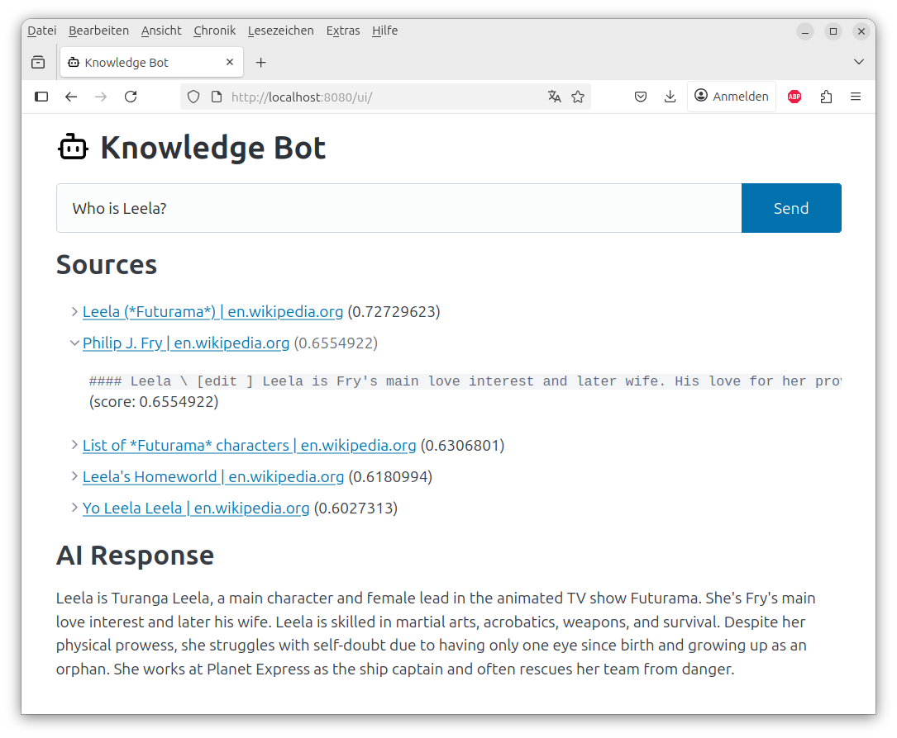
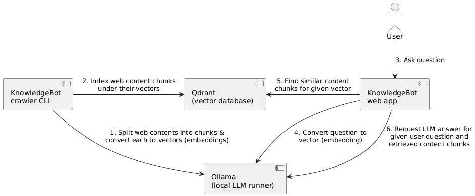

# KnowledgeBot

A Retrieval-Augmented Generation (RAG) AI assistant for question answering over custom document collections, using a vector database and local LLMs.

## Overview

KnowledgeBot enables you to index web content or Wikipedia articles into a vector database and ask questions about the ingested knowledge. It uses a local LLM (via [Ollama](https://github.com/ollama/ollama)), [Qdrant](https://github.com/qdrant/qdrant) as a vector store, and provides both a web UI and an API for interaction.

- **Retrieval-Augmented Generation**: Combines document retrieval with LLM-based answer generation.
- **Vector Database Integration**: Uses Qdrant for fast semantic search.
- **Document Embedding**: Crawls and embeds web pages or Wikipedia articles.
- **Web UI & API**: User-friendly web interface and HTTP API for Q&A.

### Screenshot:



## Target Audience

- AI/ML practitioners and developers
- Researchers and students interested in RAG systems
- Anyone wanting to build a local, private Q&A bot over custom data

## Current State Gap Identification

While numerous AI-powered question answering systems exist, many rely on cloud-based LLMs and proprietary vector databases, raising concerns about data privacy, cost, and control.
Existing solutions often require complex setup, lack transparency, or do not support fully local deployments.
KnowledgeBot addresses these gaps by providing an open-source, fully containerized RAG pipeline that runs entirely on local hardware, using open components like Ollama and Qdrant.
This approach empowers users to build private, domain-specific Q&A bots without exposing sensitive data to third parties. 
However, the current implementation does not yet support advanced features such as incremental data updates, fine-grained access control, or integration with non-web data sources (e.g., PDFs, Office documents).
Future work should address these limitations and further benchmark KnowledgeBot against state-of-the-art RAG systems.

## Prerequisites

- [Docker](https://docs.docker.com/engine/install/) as well as its [compose plugin](https://docs.docker.com/compose/install/) installed
- x86_64 Linux or MacOS recommended
- At least 8GB RAM (more for large models)
- At least 5GB free disk space
- Internet access for model and data downloads

## Installation

Clone the repository and start the services:

```sh
git clone https://github.com/mgoltzsche/knowledgebot.git
cd knowledgebot
make compose-up
```

This will launch the following services:
- **KnowledgeBot** (web/API server, port 8080)
- **Qdrant** (vector database, port 6333)
- **Ollama** (local LLM server, port 11434)

## Environment Setup

- All dependencies are managed via Docker Compose.
- The main application is written in Go (see `go.mod` for details).
- No manual Python or Go environment setup is required.

To download the required LLMs into the Ollama volume, run:
```sh
make pull-models
```
Depending on your internet connection the model download takes a while.
With 100Mbit/s the download takes around 5 minutes.

## Usage

### Ingesting Data

Before you can use the web app you need to populate the vector database with useful data about the topic you want the AI to answer questions about.

To crawl and embed a website or Wikipedia page, use the provided Makefile targets.
For example, to crawl 100 Futurama-related Wikipedia pages, run:

```sh
make crawl-wikipedia-futurama
```
(Takes around 2.5 minutes.)

To crawl a custom site:
```sh
make crawl URL=https://example.com MAX_DEPTH=2 MAX_PAGES=100
```

You can adjust `URL`, `MAX_DEPTH` and `MAX_PAGES` as needed.

### Web UI

The primary interface provides an intuitive chat experience:

* Real-time streaming: Responses are streamed as they're generated.
* Source attribution: Shows the documents used to generate the answer.
* Context snippets: Preview the exact text passages that informed the response.

Open your browser at [http://localhost:8080](http://localhost:8080) and enter your question (see [example questions](#example-questions) below).

### API

You can also query the API directly:
```sh
curl "http://localhost:8080/api/qna?q=What%20are%20the%20main%20Futurama%20characters?"
```

The `/api/qna` endpoint returns a stream of [Server-Sent Events (SSE)](https://en.wikipedia.org/wiki/Server-sent_events) with structured JSON, e.g.:

```
{"sources": [{"url": "...", "title": "...", "snippets": [{"text": "...", "score": 0.753}]}]}
{"chunk": "The main characters"}
{"chunk": " in Futurama include"}
{"chunk": " Fry, Leela, Bender and others."}
```

### Example questions

* "What are the main Futurama characters?"
  * -> Fry, Leela, Bender and other Planet Express employees such as Professor Farnsworth, Dr. Zoidberg, Amy Wong.
* "Who is Leela?"
  * -> A main character, spaceship captain, working for Planet Express, Fry's big love.
* "Tell me about Professor Farnsworth"
  * -> A main character in Futurama, runs the Planet Express delivery service company, inventor.

### Qdrant Dashboard

You can inspect the vector database using the Qdrant web UI at: [http://localhost:6333/dashboard](http://localhost:6333/dashboard)

## Data Requirements

- Models are downloaded into the docker volume of the Ollama container. By default the following LLM models are used:
  - `all-minilm` for embeddings.
  - `qwen2.5:3b` for chat completion in order to work with CPU inference on consumer hardware.
- The Qdrant vector database state is persisted within another docker volume.
  - By default the crawler populates the vector database with chunks from Futurama-related Wikipedia articles.

## Testing

Run unit tests:
```sh
make test
```

## Configuration

You don't have to configure anything because the defaults are sufficient.
All configuration options can be overwritten via environment variables in `compose.yaml`.

Optionally you can configure host-specific values such as e.g. an OpenAI API key by copying the `.env_example` file to `.env` and making your changes there.

## Technical Implementation Details

KnowledgeBot implements a classic RAG pipeline within a Go service, using the Qdrant vector database and Ollama.

### Component diagram:



### RAG Pipeline Deep Dive

**1. Document Ingestion**

- HTML content converted to clean Markdown using `html-to-markdown`
- Text chunked into 768-character segments with 175-character overlap
- Each chunk embedded using `all-minilm` model (384 dimensions)
- Metadata preserved (URL, title, content) for source attribution

**2. Semantic Retrieval**

- User questions converted to vectors using same embedding model
- Cosine similarity search in Qdrant with configurable thresholds
- Up to 15 most relevant chunks retrieved per query
- Results ranked by relevance score

**3. Response Generation**

- Retrieved context combined with system prompt template
- Local LLM generates responses without sending data to external services
- Streaming output provides real-time user feedback
- Source references maintained throughout the pipeline

### Performance Characteristics

- **Search Latency**: Fast semantic search via Qdrant.
- **Response Time**: 2-60 seconds depending on question complexity and hardware.
- **Scalability**: Supports thousands of documents per collection.
- **Privacy**: All processing happens locally - no data leaves your infrastructure.

## Methodology & Technical Decisions

### Why These Technologies?

**Go for Core Logic**: Chosen for its excellent concurrency model, making it ideal for web crawling and serving concurrent user requests while maintaining low resource usage. Also, as a statically typed programming language it can help reduce the amount of turnarounds since obvious errors are caught by the compiler early.

**Qdrant Vector Database**: Selected for its production-ready vector search capabilities, efficient storage, scalability and excellent Go client library support.

**Ollama for LLM Serving**: Provides a Docker-friendly way to run local models with consistent APIs, avoiding external dependencies and ensuring data privacy.

**Local-First Architecture**: Ensures all user data and queries remain on the user's infrastructure, addressing privacy concerns common in enterprise environments.

## Limitations

The RAG approach comes with some limitations:
* Sometimes the LLM fails to mention important information within its response even though it was retrieved from the vector database and provided to it.
* Trade-off: Fewer vector database results and smaller chunks are faster to process by the LLM but may lack important information. Using bigger chunks and more result documents on the other hand provide more information but may as well contain a lot of irrelevant information (lowering the vector database's matching score) and result in less performant but more expensive and energy-intensive processing.

## License

This project is licensed under the [Apache 2.0 License](LICENSE).

## Contributing

Contributions are welcome! Please feel free to open issues or pull requests.

## Contact & Support

For questions or support, please open an issue on GitHub.
